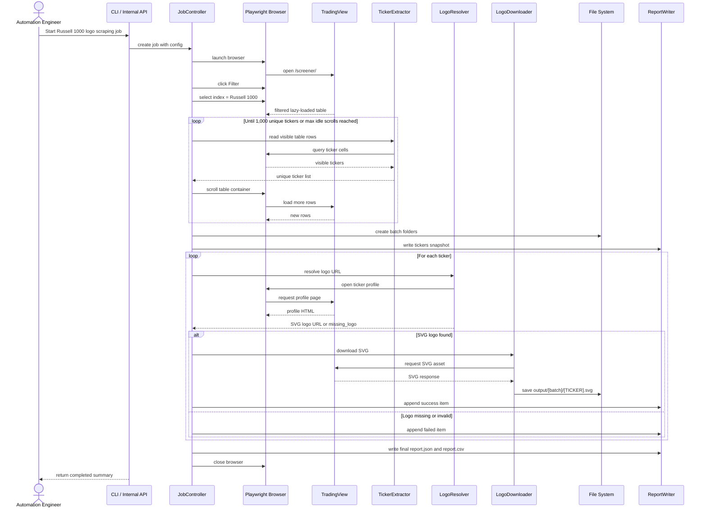
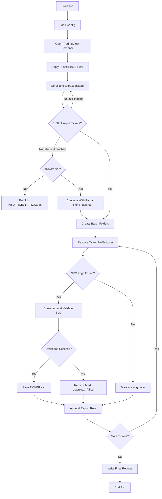

# Technical Specification: Automated Web Scraping for US Stock Logos

## 1. Document Control

| Field | Detail |
|---|---|
| Project | Pocket - Automated Web Scraping for US Stock Logos |
| Related BRD | IDR-89: `[Pocket][Automate] Automated Web Scraping for US Stock Logos` |
| Status | In Progress |
| Owner | Internal Automation / Design / Dev Team |
| Source Website | TradingView Stock Screener |
| Target Universe | Russell 1000 |
| Output Format | SVG |
| Last Updated | 2026-04-27 |

## 2. Executive Summary

Pocket ต้องการอัปเดตโลโก้หุ้นสหรัฐฯ ให้ครบถ้วนและคมชัดขึ้นสำหรับ UI/UX ของแอป โดยเริ่มจากกลุ่มหุ้นที่มีนัยสำคัญต่อปริมาณการเทรดมากที่สุดก่อน คือ Russell 1000

ระบบนี้เป็น automation script สำหรับ:

- เข้า TradingView Stock Screener
- เลือก filter เป็น Russell 1000 ผ่าน UI
- scroll ตารางแบบ lazy loading เพื่อเก็บ ticker ให้ครบ 1,000 ตัว
- เข้า profile ของแต่ละ ticker เพื่อหาโลโก้ขนาดเต็ม
- ดาวน์โหลดโลโก้เป็นไฟล์ SVG
- แบ่งไฟล์ออกเป็น 10 batch folder folder ละ 100 รูป เพื่อให้ทีม Design bulk import เข้า Figma ได้ง่ายและไม่ทำให้เครื่องค้าง

## 3. Goals and Non-Goals

### 3.1 Goals

- ลด manual effort ในการหาและดาวน์โหลดโลโก้หุ้น
- ได้ชุดไฟล์โลโก้ Russell 1000 ที่เป็น SVG และพร้อมใช้งาน
- ได้ output structure ที่เหมาะกับการ bulk import เข้า Figma
- มี report สำหรับตรวจสอบ success, missing logo และ failure
- รองรับการ retry และ resume เพื่อให้รันงานต่อได้เมื่อบาง ticker ล้มเหลว

### 3.2 Non-Goals

- ไม่รวมการ import เข้า Figma อัตโนมัติ
- ไม่รวมการ replace asset ใน codebase ของ Pocket app
- ไม่รวมการ optimize app size หลังนำ asset เข้าแอป
- ไม่รวม Russell 2000 หรือหุ้น long-tail ใน phase แรก
- ไม่รวมการใช้ third-party logo API เว้นแต่ได้รับ approval ใน phase ถัดไป

## 4. Users and Use Cases

### 4.1 Primary Users

- Design Team: ใช้ไฟล์ SVG เพื่อ bulk import เข้า Figma
- Development Team: ใช้ asset ที่ผ่านการตรวจสอบแล้วสำหรับ replace ในแอป
- Automation Engineer: รัน script, ตรวจ report, rerun เฉพาะรายการที่ fail

### 4.2 High-Level User Story

As an Internal Team member  
I want to receive 10 folders of Russell 1000 stock logo SVG files, 100 files per folder  
So that I can bulk import the assets into Figma without performance issues

## 5. Scope

### 5.1 In Scope

- Browser automation ด้วย Playwright หรือ framework ที่เทียบเท่า
- UI interaction บน TradingView Stock Screener
- Russell 1000 filter selection
- Lazy-loaded table scrolling
- Ticker extraction จำนวน 1,000 unique tickers
- Logo URL resolution จากหน้า stock profile
- SVG download
- Batch folder creation
- JSON/CSV report generation
- Retry, timeout, rate limit และ resume mode

### 5.2 Out of Scope

- Bypass paywall, captcha, login restriction หรือ anti-bot protection
- Scraping แบบ aggressive ที่สร้าง load ต่อ source website
- การ guarantee ว่า ticker list จะตรงกับ official Russell source ทุกวัน
- Manual cleanup ของโลโก้ที่ผิดหรือหาย

## 6. Assumptions and Constraints

- TradingView UI selector อาจเปลี่ยนได้ จึงต้องแยก selector ไว้ใน config
- ผู้รัน script ต้องตรวจสอบสิทธิ์การใช้งานและ Terms of Service ของ TradingView ก่อนใช้งานจริง
- บาง ticker อาจไม่มีโลโก้, ไม่มี SVG, หรือ profile URL ไม่ตรงตาม pattern
- Russell 1000 membership เปลี่ยนได้ตามเวลา จึงต้องบันทึก run timestamp และ ticker snapshot
- Phase แรกแนะนำให้เป็น CLI/local automation ก่อน หากต้อง schedule หรือให้หลายทีมใช้งานจึงค่อย expose เป็น internal API

## 7. Functional Requirements

### FR-001: Open TradingView Screener

ระบบต้องเปิด URL:

```text
https://www.tradingview.com/screener/
```

### FR-002: Apply Russell 1000 Filter

ระบบต้องจำลองการคลิก UI เพื่อ:

- เปิด filter panel
- ค้นหา/เลือก index filter
- เลือกค่า `Russell 1000`
- apply filter และรอให้ตารางโหลดผลลัพธ์

### FR-003: Extract Tickers from Lazy-Loaded Table

ระบบต้อง:

- อ่าน ticker จาก row ที่ visible อยู่ใน screener table
- scroll table container ลงเรื่อยๆ
- wait ให้ lazy-loaded rows โหลดเพิ่ม
- de-duplicate ticker
- หยุดเมื่อเก็บครบ 1,000 unique tickers
- หยุดและ report error เมื่อ scroll แล้วไม่มี ticker ใหม่ตาม `maxIdleScrolls`

### FR-004: Resolve Full-Size SVG Logo

สำหรับแต่ละ ticker ระบบต้อง:

- สร้างหรือค้นหา profile URL ของ ticker
- เปิดหน้า profile ผ่าน browser automation
- หา element โลโก้
- resolve URL ของ full-size logo
- validate ว่า logo URL เป็น SVG หรือ response content type เป็น SVG

### FR-005: Download SVG

ระบบต้อง:

- ดาวน์โหลด SVG ด้วย HTTP client หรือ browser request context
- ตรวจสอบ HTTP status เป็น 2xx
- ตรวจสอบ content ว่าเป็น SVG ที่ parse ได้
- บันทึกไฟล์เป็น `[TICKER].svg`
- retry เมื่อเกิด transient error

### FR-006: Batch Output Structure

ระบบต้องสร้าง output folder ดังนี้:

```text
output/
  1-100/
  101-200/
  201-300/
  301-400/
  401-500/
  501-600/
  601-700/
  701-800/
  801-900/
  901-1000/
  report.json
  report.csv
  tickers.json
```

Folder assignment คำนวณจาก sequence ของ ticker หลัง de-duplicate แล้ว:

| Sequence | Folder |
|---:|---|
| 1-100 | `1-100` |
| 101-200 | `101-200` |
| 201-300 | `201-300` |
| 301-400 | `301-400` |
| 401-500 | `401-500` |
| 501-600 | `501-600` |
| 601-700 | `601-700` |
| 701-800 | `701-800` |
| 801-900 | `801-900` |
| 901-1000 | `901-1000` |

### FR-007: Generate Reports

เมื่อจบ run ระบบต้องสร้าง:

- `report.json`: รายละเอียดแบบ structured สำหรับ automation/debugging
- `report.csv`: รายการแบบเปิดใน spreadsheet ได้
- `tickers.json`: snapshot ของ ticker universe ที่ scrape ได้

Report item ต้องมีอย่างน้อย:

- sequence
- ticker
- exchange
- batchFolder
- profileUrl
- logoUrl
- filePath
- status
- errorCode
- errorMessage
- retryCount
- downloadedAt

### FR-008: Resume Mode

ระบบต้องรองรับ `--resume` โดย:

- อ่าน `report.json` เดิม
- skip ticker ที่ `status = success` และไฟล์ยังอยู่จริง
- retry เฉพาะ `missing_logo`, `download_failed`, `retry_exhausted`, `invalid_logo_format`
- ไม่ overwrite ไฟล์เดิม เว้นแต่ระบุ `--overwrite`

## 8. Non-Functional Requirements

### 8.1 Reliability

- Ticker-level failure ต้องไม่ทำให้ทั้ง job ล้ม
- ต้องมี retry per ticker
- ต้องมี timeout แยกสำหรับ page load, selector wait และ download
- ต้องเขียน report แบบ incremental เพื่อไม่สูญข้อมูลเมื่อ process ถูก stop

### 8.2 Performance

- Ticker extraction ควรเสร็จภายใน 15 นาที ภายใต้ network ปกติ
- Download phase ใช้ controlled concurrency
- ค่า default concurrency แนะนำ `3`
- ต้องมี random delay/rate limit เพื่อลด load ต่อ source website

### 8.3 Maintainability

- Selector, URL pattern, timeout, retry, output path ต้องอยู่ใน config
- แยก browser automation, logo resolver, downloader, writer และ reporter เป็น module ชัดเจน
- Log ต้องอ่านง่ายพอสำหรับ rerun/debug

### 8.4 Compliance

- ต้องตรวจสอบสิทธิ์การใช้งาน TradingView และนโยบาย scraping ก่อน production run
- ต้องไม่ bypass captcha, login, paywall หรือ access control
- ต้องมี rate limit และไม่ทำ request จำนวนมากพร้อมกันเกินจำเป็น

## 9. Recommended Architecture

### 9.1 Technology Recommendation

แนะนำ implementation แรกเป็น:

- Node.js + TypeScript
- Playwright สำหรับ browser automation
- Native `fetch` หรือ `undici` สำหรับดาวน์โหลด SVG
- Zod สำหรับ config validation
- CSV writer สำหรับ export report

Python + Playwright ใช้ได้เช่นกัน หากทีม automation ถนัด Python มากกว่า

### 9.2 Components

| Component | Responsibility |
|---|---|
| `JobController` | คุม workflow ทั้งหมด, retry, resume, summary |
| `ConfigLoader` | โหลดและ validate config |
| `ScreenerNavigator` | เปิด TradingView screener และ apply filter |
| `TickerExtractor` | scroll table และ extract unique ticker |
| `ProfileUrlBuilder` | สร้าง/resolve URL ของ ticker profile |
| `LogoResolver` | หา full-size SVG logo URL จาก profile page |
| `LogoDownloader` | ดาวน์โหลด SVG และ validate response |
| `BatchWriter` | คำนวณ batch folder และ save file |
| `ReportWriter` | เขียน JSON/CSV report แบบ incremental |
| `Logger` | เขียน structured logs |

## 10. Sequence Diagram



## 11. Process Flow



## 12. Output Specification

### 12.1 File Naming

```text
[TICKER].svg
```

Examples:

```text
AAPL.svg
MSFT.svg
NVDA.svg
BRK.B.svg
```

Ticker filename ต้อง sanitize character ที่ filesystem ไม่รองรับ โดยยังเก็บ original ticker ไว้ใน report

### 12.2 Report JSON Example

```json
{
  "jobId": "us-logo-russell-1000-20260427-103000",
  "source": "tradingview",
  "index": "Russell 1000",
  "targetCount": 1000,
  "batchSize": 100,
  "startedAt": "2026-04-27T10:30:00+07:00",
  "finishedAt": "2026-04-27T11:20:00+07:00",
  "summary": {
    "totalTickers": 1000,
    "success": 985,
    "missingLogo": 10,
    "downloadFailed": 5,
    "invalidLogoFormat": 0
  },
  "items": [
    {
      "sequence": 1,
      "ticker": "AAPL",
      "exchange": "NASDAQ",
      "batchFolder": "1-100",
      "profileUrl": "https://www.tradingview.com/symbols/NASDAQ-AAPL/",
      "logoUrl": "https://static.tradingview.com/static/bundles/apple.svg",
      "filePath": "output/1-100/AAPL.svg",
      "status": "success",
      "errorCode": null,
      "errorMessage": null,
      "retryCount": 0,
      "downloadedAt": "2026-04-27T10:45:00+07:00"
    }
  ]
}
```

### 12.3 CSV Columns

```text
sequence,ticker,exchange,batchFolder,profileUrl,logoUrl,filePath,status,errorCode,errorMessage,retryCount,downloadedAt
```

### 12.4 Status Values

| Status | Description |
|---|---|
| `success` | ดาวน์โหลดและบันทึก SVG สำเร็จ |
| `missing_logo` | ไม่พบ logo element หรือ logo URL |
| `invalid_logo_format` | พบ logo แต่ไม่ใช่ SVG |
| `download_failed` | download fail หลัง retry |
| `retry_exhausted` | retry ครบแล้วยังไม่สำเร็จ |
| `skipped` | ข้ามเพราะ resume mode และไฟล์มีอยู่แล้ว |

## 13. CLI Specification

Phase แรกแนะนำให้ส่งมอบเป็น CLI

### 13.1 Run Full Job

```bash
stock-logo-scraper run \
  --source tradingview \
  --index "Russell 1000" \
  --target-count 1000 \
  --batch-size 100 \
  --output ./output \
  --format svg \
  --concurrency 3 \
  --max-retries 3 \
  --headless
```

### 13.2 Resume Failed Items

```bash
stock-logo-scraper run \
  --source tradingview \
  --index "Russell 1000" \
  --output ./output \
  --resume
```

### 13.3 Validate Existing Output

```bash
stock-logo-scraper validate \
  --output ./output \
  --report ./output/report.json
```

### 13.4 Expected Exit Codes

| Code | Meaning |
|---:|---|
| `0` | Completed, all target logos succeeded |
| `1` | Completed with ticker-level failures; check report |
| `2` | Config or environment error |
| `3` | TradingView access, filter, selector, or extraction error |
| `4` | Output write/permission error |

## 14. Internal API Specification

ใช้ section นี้หากต้อง expose automation เป็น internal service ในอนาคต

### 14.1 Create Scraping Job

```http
POST /api/v1/stock-logo-scraping/jobs
Content-Type: application/json
```

Request:

```json
{
  "source": "tradingview",
  "index": "Russell 1000",
  "targetCount": 1000,
  "batchSize": 100,
  "outputPath": "./output",
  "format": "svg",
  "concurrency": 3,
  "maxRetries": 3,
  "resume": false,
  "overwrite": false,
  "headless": true,
  "allowPartial": false
}
```

Response `202 Accepted`:

```json
{
  "jobId": "us-logo-russell-1000-20260427-103000",
  "status": "queued",
  "createdAt": "2026-04-27T10:30:00+07:00"
}
```

### 14.2 Get Job Status

```http
GET /api/v1/stock-logo-scraping/jobs/{jobId}
```

Response `200 OK`:

```json
{
  "jobId": "us-logo-russell-1000-20260427-103000",
  "status": "running",
  "phase": "downloading_logos",
  "progress": {
    "targetCount": 1000,
    "tickersCollected": 1000,
    "logosProcessed": 420,
    "success": 410,
    "missingLogo": 5,
    "downloadFailed": 5
  },
  "startedAt": "2026-04-27T10:30:00+07:00",
  "updatedAt": "2026-04-27T10:55:00+07:00"
}
```

### 14.3 Download Job Report

```http
GET /api/v1/stock-logo-scraping/jobs/{jobId}/report?format=json
```

Query parameters:

| Name | Type | Required | Description |
|---|---|---|---|
| `format` | string | No | `json` or `csv`; default `json` |

Response `200 OK`: returns report file

### 14.4 Download Output Archive

```http
GET /api/v1/stock-logo-scraping/jobs/{jobId}/archive
```

Response `200 OK`: returns ZIP file containing:

```text
1-100/
101-200/
201-300/
301-400/
401-500/
501-600/
601-700/
701-800/
801-900/
901-1000/
report.json
report.csv
tickers.json
```

### 14.5 Cancel Job

```http
POST /api/v1/stock-logo-scraping/jobs/{jobId}/cancel
```

Response `200 OK`:

```json
{
  "jobId": "us-logo-russell-1000-20260427-103000",
  "status": "cancel_requested"
}
```

### 14.6 API Job Status Values

| Status | Description |
|---|---|
| `queued` | Job created but not started |
| `running` | Job currently running |
| `completed` | Job completed; ticker-level failures may exist |
| `failed` | Job failed before usable output |
| `cancel_requested` | Cancel request accepted |
| `cancelled` | Job cancelled |

### 14.7 API Error Response

```json
{
  "error": {
    "code": "JOB_NOT_FOUND",
    "message": "Scraping job was not found.",
    "details": {
      "jobId": "us-logo-russell-1000-20260427-103000"
    }
  }
}
```

Common error codes:

| Code | HTTP Status | Description |
|---|---:|---|
| `VALIDATION_ERROR` | 400 | Request config ไม่ถูกต้อง |
| `JOB_NOT_FOUND` | 404 | ไม่พบ jobId |
| `JOB_ALREADY_RUNNING` | 409 | มี job เดียวกันกำลังรันอยู่ |
| `SOURCE_ACCESS_FAILED` | 502 | เข้า source website ไม่ได้ |
| `SELECTOR_NOT_FOUND` | 502 | UI selector เปลี่ยนหรือหาไม่เจอ |
| `INTERNAL_ERROR` | 500 | Unexpected service error |

## 15. Configuration Example

```json
{
  "source": "tradingview",
  "screenerUrl": "https://www.tradingview.com/screener/",
  "index": "Russell 1000",
  "targetCount": 1000,
  "batchSize": 100,
  "outputPath": "./output",
  "format": "svg",
  "headless": true,
  "concurrency": 3,
  "maxRetries": 3,
  "allowPartial": false,
  "timeouts": {
    "pageLoadMs": 30000,
    "selectorMs": 15000,
    "downloadMs": 30000,
    "scrollIdleMs": 1200
  },
  "rateLimit": {
    "minDelayMs": 500,
    "maxDelayMs": 2000
  },
  "selectors": {
    "filterButton": "[data-name='screener-filter-button']",
    "indexFilterInput": "[data-name='index-filter-input']",
    "tickerCell": "[data-field='ticker']",
    "exchangeCell": "[data-field='exchange']",
    "tableScrollContainer": "[data-name='screener-table-scroll']",
    "profileLogoImage": "img[alt*='logo']"
  }
}
```

หมายเหตุ: selector ด้านบนเป็น placeholder ต้อง verify จาก TradingView จริงตอน implement

## 16. Error Handling

### 16.1 Extraction Errors

| Scenario | Behavior |
|---|---|
| Screener page load fail | Retry page load, then fail job with `SOURCE_ACCESS_FAILED` |
| Filter button not found | Fail job with `SELECTOR_NOT_FOUND` |
| Russell 1000 option not found | Fail job with `FILTER_OPTION_NOT_FOUND` |
| Filter result empty | Fail job with `FILTER_RESULT_EMPTY` |
| Collected fewer than 1,000 tickers | Fail with `INSUFFICIENT_TICKERS` unless `allowPartial=true` |

### 16.2 Logo Resolution Errors

| Scenario | Behavior |
|---|---|
| Profile page load fail | Retry per ticker |
| Logo element missing | Mark `missing_logo` |
| Logo URL missing | Mark `missing_logo` |
| Logo response not SVG | Mark `invalid_logo_format` |

### 16.3 Download Errors

| Scenario | Behavior |
|---|---|
| HTTP 429/5xx | Retry with backoff |
| HTTP 404 | Mark `download_failed` |
| File write fail | Retry write if transient; otherwise mark `download_failed` |
| Existing file in resume mode | Mark `skipped` if report already says `success` |

## 17. Acceptance Criteria Mapping

| BRD Acceptance Criteria | Technical Validation |
|---|---|
| Bot คลิก UI เพื่อ filter Russell 1000 ได้ | Run log หรือ Playwright trace แสดงว่าเลือก filter แล้ว table ถูกโหลด |
| Bot scroll เพื่อดึง ticker ได้ครบ 1,000 ตัว | `tickers.json` มี 1,000 unique tickers และไม่มี duplicate |
| Bot ดาวน์โหลดภาพขนาดเต็ม SVG จากหน้า profile | ไฟล์ output เป็น valid SVG และ report มี `logoUrl` |
| ระบบแบ่ง folder ละ 100 รูป รวม 10 folders | output มี folder `1-100` ถึง `901-1000` และ mapping ถูกต้องตาม sequence |

## 18. Testing Plan

### 18.1 Unit Tests

- Batch folder calculation
- Ticker de-duplication
- Filename sanitization
- Report writer JSON/CSV
- Retry/backoff behavior
- Resume mode behavior
- SVG validation

### 18.2 Integration Tests

- Run target count = 10 เพื่อทดสอบ end-to-end flow
- Verify ว่าสร้าง folder/report ถูกต้อง
- Verify saved files เป็น parseable SVG
- Verify missing logo case ไม่ทำให้ job ล้ม

### 18.3 Manual QA

- เปิด SVG sample จากทุก batch folder
- ตรวจ logo ว่าตรงกับ ticker
- Import batch หนึ่งเข้า Figma เพื่อดู performance และ compatibility
- ตรวจ `report.csv` สำหรับรายการ fail/missing

## 19. Risks and Mitigations

| Risk | Impact | Mitigation |
|---|---|---|
| TradingView selector เปลี่ยน | Bot fail | Centralize selectors, add selector smoke test |
| Source website block automation | Job fail | ใช้ rate limit, concurrency ต่ำ, ตรวจ ToS ก่อนใช้งาน |
| Logo บาง ticker ไม่มีหรือไม่ใช่ SVG | Output ไม่ครบ | Mark status ใน report แล้วให้ manual follow-up |
| Russell 1000 membership เปลี่ยน | Ticker list ต่างกันในแต่ละ run | บันทึก timestamp และ ticker snapshot |
| Profile URL pattern เปลี่ยน | Resolve logo fail | แยก `ProfileUrlBuilder` และรองรับ lookup จาก row link |
| Asset size เพิ่มในแอป | App size bloat | Post-launch ต้อง audit app size หลัง replace asset |

## 20. Post-Launch Review

หลังนำ asset ไปใช้งาน ทีมควรตรวจ:

- UI แสดงโลโก้ Russell 1000 ได้คมชัด ไม่แตก
- App size ไม่เพิ่มจนกระทบ user experience
- ไม่มี regression ในหน้าจอที่แสดง stock list, watchlist, portfolio หรือ order flow
- Customer Support ยังได้รับ report เรื่อง "โลโก้หุ้นที่เทรดบ่อยหายไป" หรือไม่

## 21. Future Enhancements

- เพิ่ม support Russell 2000
- เพิ่ม long-tail US stock universe
- ตั้ง scheduled refresh cycle และ SLA
- เพิ่ม third-party logo API fallback หลังผ่าน approval
- เพิ่ม Figma import automation
- เพิ่ม visual diff เพื่อตรวจ logo rebrand
- เพิ่ม dashboard แสดง missing/failure rate ต่อ run

## 22. Open Questions

- ทีมยืนยัน permission/ToS สำหรับ scraping TradingView แล้วหรือยัง
- หากบาง ticker ไม่มี SVG ต้องใช้ fallback PNG หรือ placeholder หรือไม่
- ต้องการเก็บ output ลง cloud storage, shared drive หรือ repository ใด
- ต้องการ schedule refresh ทุกกี่เดือน
- ต้องการให้ source of truth ของ Russell membership มาจาก TradingView อย่างเดียวหรือเทียบกับ source อื่นด้วย
