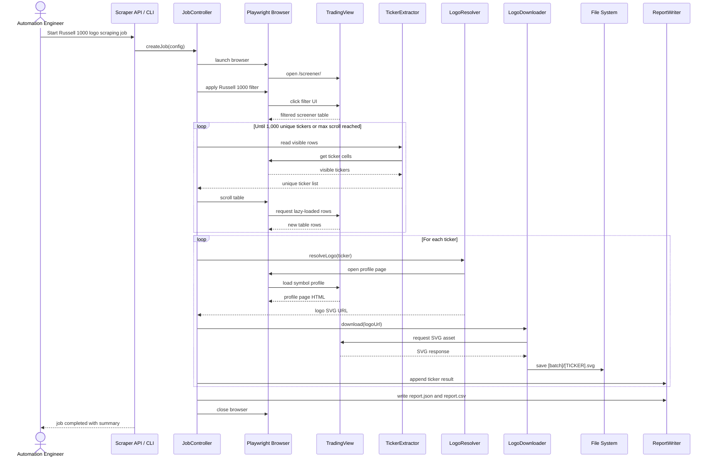
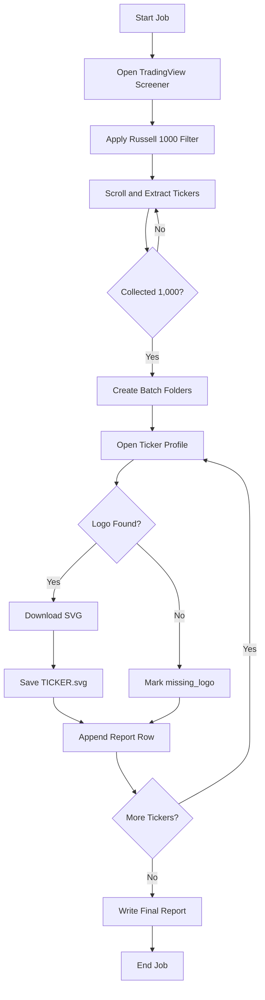

# Automated Web Scraping for US Stock Logos - Technical Specification

## 1. Overview

### Objective

Build an automation tool to collect and download US stock logo assets for the Russell 1000 universe. The tool must:

- Open TradingView Stock Screener.
- Filter symbols by the Russell 1000 index.
- Extract 1,000 ticker symbols from a lazy-loaded table.
- Visit each stock profile page.
- Download the full-size SVG logo.
- Save files into 10 batch folders, 100 logos per folder.

### Business Goal

Provide high-quality, up-to-date US stock logo assets for the Pocket application so Design and Development teams can bulk import them into Figma and later replace missing or low-quality app assets.

### Primary Users

- Internal Design Team
- Internal Development Team
- Automation Engineer

## 2. Scope

### In Scope

- Browser automation for TradingView screener UI.
- Russell 1000 ticker extraction.
- Lazy-loading table scroll handling.
- Logo image discovery from each stock page.
- SVG download.
- Batch output folder generation.
- Download result report.
- Retry and error logging.

### Out of Scope

- Replacing assets inside the Pocket application.
- Figma import automation.
- Mobile app build-size optimization.
- Long-tail stock coverage outside Russell 1000.
- Paid third-party logo API integration, unless approved later.

## 3. Assumptions

- TradingView pages and selectors may change, so selectors must be configurable.
- The tool will be run internally by an authorized team member.
- The automation must respect TradingView rate limits, robots policy, and terms of service.
- Some tickers may not have an SVG logo. These cases must be reported instead of blocking the whole job.
- Russell 1000 membership may change over time, so the extracted ticker list is treated as a snapshot.

## 4. Functional Requirements

### FR-001: Open TradingView Screener

The bot must open:

```text
https://www.tradingview.com/screener/
```

### FR-002: Apply Russell 1000 Filter

The bot must simulate UI interaction to:

- Open the filter panel.
- Select the index filter.
- Choose `Russell 1000`.
- Apply the filter.

### FR-003: Extract Tickers from Lazy-Loaded Table

The bot must:

- Read ticker symbols from the visible screener table.
- Scroll the table down repeatedly.
- Wait for new rows to load.
- De-duplicate symbols.
- Stop when 1,000 unique tickers are collected or when no new ticker appears after the configured max retry count.

### FR-004: Download Full-Size SVG Logos

For each ticker, the bot must:

- Open the ticker profile page.
- Locate the stock logo image element.
- Resolve the full-size SVG URL.
- Download the SVG file.
- Save the file as `[TICKER].svg`.

### FR-005: Batch Output Folders

The bot must create folders with this structure:

```text
output/
  1-100/
    AAPL.svg
    MSFT.svg
  101-200/
  201-300/
  301-400/
  401-500/
  501-600/
  601-700/
  701-800/
  801-900/
  901-1000/
```

### FR-006: Generate Run Report

At the end of each run, the bot must generate:

```text
output/report.json
output/report.csv
```

Each report row must include:

- Ticker
- Sequence number
- Batch folder
- Profile URL
- Logo URL
- Status: `success`, `missing_logo`, `download_failed`, `skipped`, `retry_exhausted`
- Error message, if any
- Download timestamp

## 5. Non-Functional Requirements

### Reliability

- The bot must support retry per ticker.
- Failed tickers must not stop the whole job.
- The bot must support resume mode from an existing report.

### Performance

- The extraction phase should complete within 15 minutes under normal network conditions.
- The logo download phase should use controlled concurrency.
- Default concurrency should be conservative, for example 3-5 pages or requests at a time.

### Maintainability

- UI selectors must be centralized in a config file.
- Output path, target count, batch size, timeout, and retry count must be configurable.
- Browser automation and downloader logic must be separated.

### Compliance

- The bot must use rate limiting.
- The bot must avoid aggressive scraping behavior.
- Before production use, the team must confirm that the source website usage is permitted.

## 6. Recommended Architecture

### Components

- `ScreenerNavigator`: Opens TradingView and applies filters.
- `TickerExtractor`: Scrolls the lazy-loaded table and collects ticker symbols.
- `LogoResolver`: Opens each ticker page and extracts the logo URL.
- `LogoDownloader`: Downloads the SVG asset.
- `BatchWriter`: Writes files to the correct batch folder.
- `ReportWriter`: Writes JSON and CSV reports.
- `JobController`: Coordinates the full workflow, retries, and resume logic.

### Suggested Technology

- Node.js + TypeScript
- Playwright for browser automation
- Native `fetch` or Axios for SVG download
- Zod or Joi for config validation
- CSV writer library for report export

Python with Playwright is also acceptable if the automation team prefers Python.

## 7. Sequence Diagram



## 8. Data Flow



## 9. Output Specification

### Folder Naming

| Batch | Folder |
|---|---|
| 1 | `1-100` |
| 2 | `101-200` |
| 3 | `201-300` |
| 4 | `301-400` |
| 5 | `401-500` |
| 6 | `501-600` |
| 7 | `601-700` |
| 8 | `701-800` |
| 9 | `801-900` |
| 10 | `901-1000` |

### File Naming

```text
[TICKER].svg
```

Examples:

```text
AAPL.svg
MSFT.svg
NVDA.svg
```

### Report JSON Example

```json
{
  "jobId": "us-logo-russell-1000-20260427-103000",
  "source": "tradingview",
  "index": "Russell 1000",
  "targetCount": 1000,
  "batchSize": 100,
  "startedAt": "2026-04-27T10:30:00+07:00",
  "finishedAt": "2026-04-27T11:20:00+07:00",
  "summary": {
    "totalTickers": 1000,
    "success": 985,
    "missingLogo": 10,
    "failed": 5
  },
  "items": [
    {
      "sequence": 1,
      "ticker": "AAPL",
      "batchFolder": "1-100",
      "profileUrl": "https://www.tradingview.com/symbols/NASDAQ-AAPL/",
      "logoUrl": "https://example.com/apple.svg",
      "filePath": "output/1-100/AAPL.svg",
      "status": "success",
      "error": null,
      "downloadedAt": "2026-04-27T10:45:00+07:00"
    }
  ]
}
```

## 10. API Specification

This section applies if the scraper is exposed as an internal service. If the team only needs a local script, see the CLI specification in section 11.

### 10.1 Create Scraping Job

```http
POST /api/v1/stock-logo-scraping/jobs
```

#### Request Body

```json
{
  "source": "tradingview",
  "index": "Russell 1000",
  "targetCount": 1000,
  "batchSize": 100,
  "outputPath": "./output",
  "format": "svg",
  "concurrency": 3,
  "maxRetries": 3,
  "resume": false,
  "headless": true
}
```

#### Response: `202 Accepted`

```json
{
  "jobId": "us-logo-russell-1000-20260427-103000",
  "status": "queued",
  "createdAt": "2026-04-27T10:30:00+07:00"
}
```

### 10.2 Get Job Status

```http
GET /api/v1/stock-logo-scraping/jobs/{jobId}
```

#### Response: `200 OK`

```json
{
  "jobId": "us-logo-russell-1000-20260427-103000",
  "status": "running",
  "phase": "downloading_logos",
  "progress": {
    "tickersCollected": 1000,
    "logosProcessed": 420,
    "success": 410,
    "failed": 5,
    "missingLogo": 5
  },
  "startedAt": "2026-04-27T10:30:00+07:00",
  "updatedAt": "2026-04-27T10:55:00+07:00"
}
```

### 10.3 Download Job Report

```http
GET /api/v1/stock-logo-scraping/jobs/{jobId}/report
```

#### Query Parameters

| Name | Type | Required | Description |
|---|---:|---:|---|
| `format` | string | No | `json` or `csv`. Default: `json`. |

#### Response: `200 OK`

Returns the generated report file.

### 10.4 Download Output Archive

```http
GET /api/v1/stock-logo-scraping/jobs/{jobId}/archive
```

#### Response: `200 OK`

Returns a ZIP file containing:

```text
1-100/
101-200/
...
901-1000/
report.json
report.csv
```

### 10.5 Cancel Job

```http
POST /api/v1/stock-logo-scraping/jobs/{jobId}/cancel
```

#### Response: `200 OK`

```json
{
  "jobId": "us-logo-russell-1000-20260427-103000",
  "status": "cancel_requested"
}
```

### 10.6 Error Response

```json
{
  "error": {
    "code": "JOB_NOT_FOUND",
    "message": "Scraping job was not found.",
    "details": {
      "jobId": "us-logo-russell-1000-20260427-103000"
    }
  }
}
```

### API Status Values

| Status | Description |
|---|---|
| `queued` | Job has been created but not started. |
| `running` | Job is currently running. |
| `completed` | Job completed. Some ticker-level failures may still exist in the report. |
| `failed` | Job failed before producing a usable output. |
| `cancel_requested` | Cancel request has been accepted. |
| `cancelled` | Job was cancelled. |

## 11. CLI Specification

For the first implementation, a CLI is recommended because this is an internal one-off or scheduled automation task.

### Command

```bash
stock-logo-scraper run \
  --source tradingview \
  --index "Russell 1000" \
  --target-count 1000 \
  --batch-size 100 \
  --output ./output \
  --format svg \
  --concurrency 3 \
  --max-retries 3 \
  --headless
```

### Resume Mode

```bash
stock-logo-scraper run \
  --source tradingview \
  --index "Russell 1000" \
  --output ./output \
  --resume
```

### Expected Exit Codes

| Code | Meaning |
|---:|---|
| `0` | Completed successfully. |
| `1` | Completed with ticker-level failures. Check report. |
| `2` | Job failed due to configuration or environment issue. |
| `3` | Job failed due to source website access or selector issue. |

## 12. Configuration Example

```json
{
  "source": "tradingview",
  "screenerUrl": "https://www.tradingview.com/screener/",
  "index": "Russell 1000",
  "targetCount": 1000,
  "batchSize": 100,
  "outputPath": "./output",
  "format": "svg",
  "headless": true,
  "concurrency": 3,
  "maxRetries": 3,
  "timeouts": {
    "pageLoadMs": 30000,
    "selectorMs": 15000,
    "downloadMs": 30000,
    "scrollIdleMs": 1200
  },
  "rateLimit": {
    "minDelayMs": 500,
    "maxDelayMs": 2000
  },
  "selectors": {
    "filterButton": "[data-name='screener-filter-button']",
    "indexFilterInput": "[data-name='index-filter-input']",
    "tickerCell": "[data-field='ticker']",
    "tableScrollContainer": "[data-name='screener-table-scroll']",
    "profileLogoImage": "img[alt*='logo']"
  }
}
```

Selector values above are placeholders. The implementation team must verify actual selectors during development.

## 13. Acceptance Criteria Mapping

| BRD Acceptance Criteria | Technical Validation |
|---|---|
| Bot can click UI to filter Russell 1000. | Automated test or recorded run shows filter applied and Russell 1000 result table loaded. |
| Bot can scroll and extract 1,000 tickers. | `report.json` contains `totalTickers = 1000` with no duplicate tickers. |
| Bot downloads full-size SVG from stock profile. | Output files are valid SVG files and report includes `logoUrl`. |
| Bot saves 10 folders with 100 images per folder. | Output has folders `1-100` through `901-1000`; each folder has up to 100 SVG files. |

## 14. Error Handling

### Ticker Extraction Errors

- If no ticker appears after filter is applied, fail the job with `FILTER_RESULT_EMPTY`.
- If fewer than 1,000 tickers are found after max scroll attempts, continue only if `allowPartial=true`; otherwise fail with `INSUFFICIENT_TICKERS`.

### Logo Resolution Errors

- If profile page fails to load, retry up to `maxRetries`.
- If logo element is not found, mark ticker as `missing_logo`.
- If logo URL is not SVG, mark ticker as `invalid_logo_format` unless fallback format is enabled.

### Download Errors

- If SVG download fails, retry.
- If final retry fails, mark as `download_failed`.
- If file already exists in resume mode, mark as `skipped`.

## 15. Testing Plan

### Unit Tests

- Batch folder calculation.
- Ticker de-duplication.
- Report generation.
- Retry behavior.
- Resume behavior.

### Integration Tests

- Run against a small target count, for example 10 tickers.
- Verify output folder and report structure.
- Verify all saved files are parseable SVG files.

### Manual QA

- Open random SVG files from each batch folder.
- Confirm logos are visually correct.
- Import one batch into Figma to confirm file compatibility.

## 16. Risks and Mitigations

| Risk | Impact | Mitigation |
|---|---|---|
| TradingView UI selector changes | Bot breaks | Centralize selectors and add selector smoke tests. |
| Website blocks automation | Job fails | Use conservative rate limits and confirm permitted usage. |
| Some tickers do not have logos | Incomplete output | Record missing tickers in report for manual follow-up. |
| SVG URL format changes | Download failure | Add resolver abstraction and fallback detection. |
| Russell 1000 membership changes | Different ticker list over time | Store extracted ticker snapshot in report. |

## 17. Future Enhancements

- Add support for Russell 2000.
- Add scheduled refresh cycle and SLA.
- Integrate an approved third-party logo API.
- Add Figma import automation.
- Add visual diff check for logo changes.
- Add app-size impact analysis after asset replacement.

## 18. Open Questions

- Does the team have confirmed permission to scrape TradingView for this purpose?
- Should failed or missing logos be replaced by a placeholder asset?
- Should non-SVG formats be accepted as fallback?
- Should ticker source be TradingView only, or should Russell membership be loaded from a separate trusted source?
- Should output be committed to a repository, uploaded to cloud storage, or shared as ZIP only?

